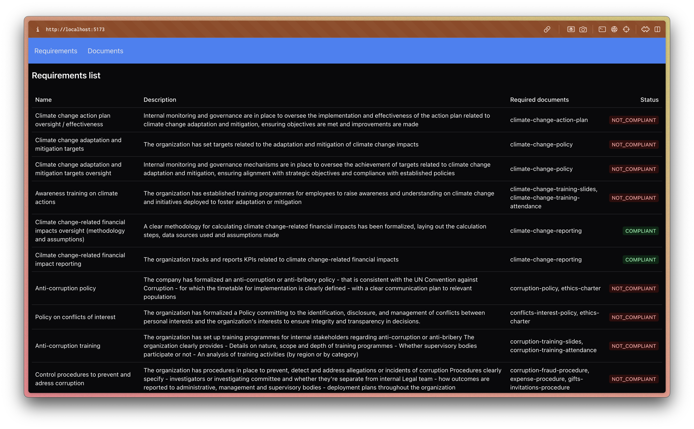
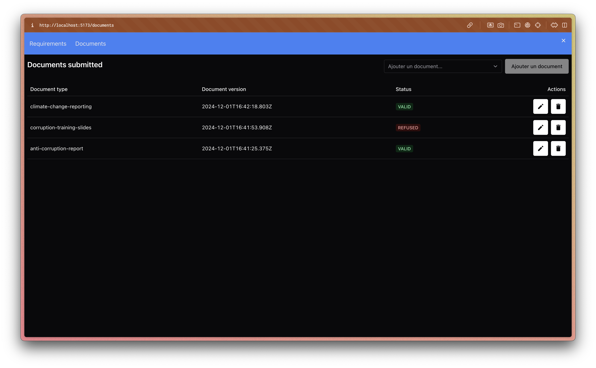

# Beavr Take-Home assessment

## Setup

### Clone repository

```shell
git clone https://github.com/pr0m3th3usEx/beavr-challenge.git
cd beavr-challenge
```

### Install dependencies

Installation requires `pnpm`

```shell
pnpm install
```

### Seed database

```shell
# Run database using docker
docker compose up -d
# Apply migration to the database (this will seed the tables automatically)
cd apps/api
pnpm run db:deploy
```

## Run application


### API

```shell
# From repository root
cd apps/api
pnpm start:dev
```

### Webapp
```shell
# From repository root
cd apps/app
pnpm dev
```

## Database

Get details about the database structure [here](./DATABASE.md)

## Images


